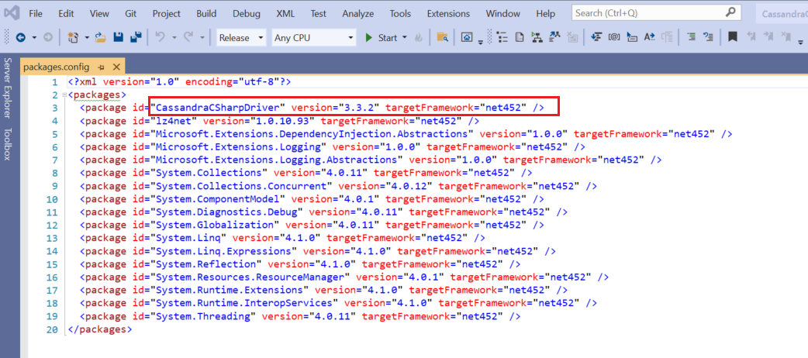
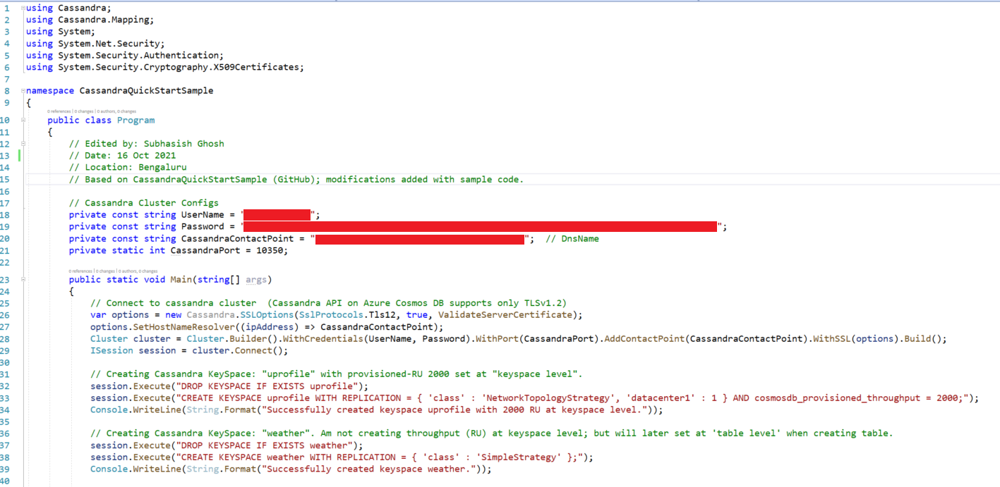
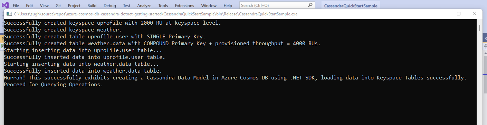
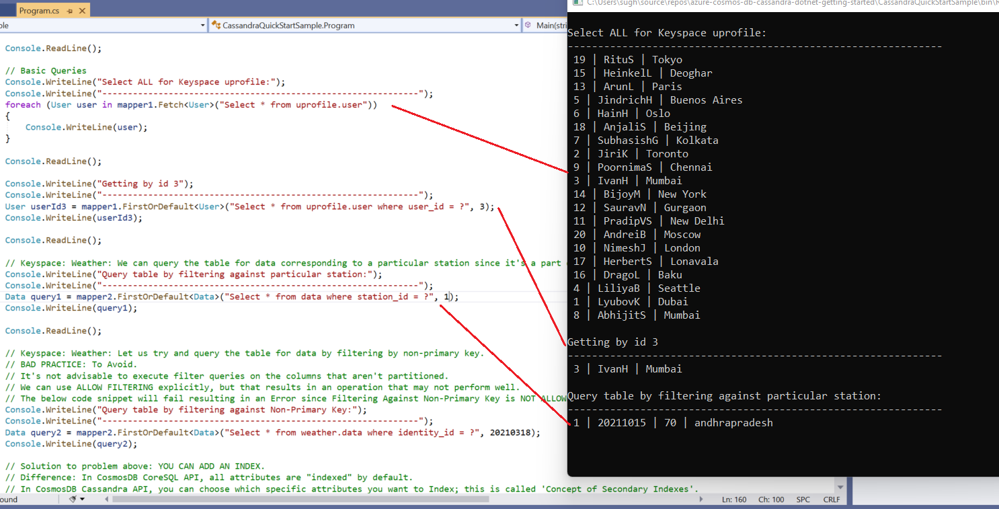
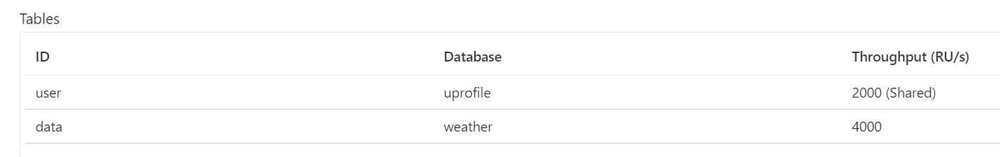
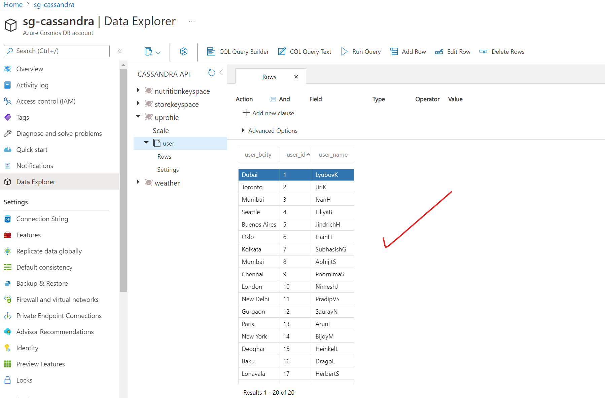
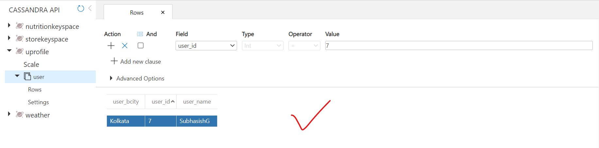
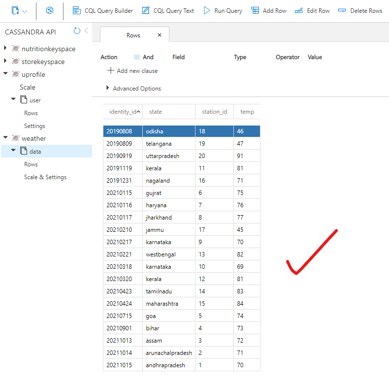
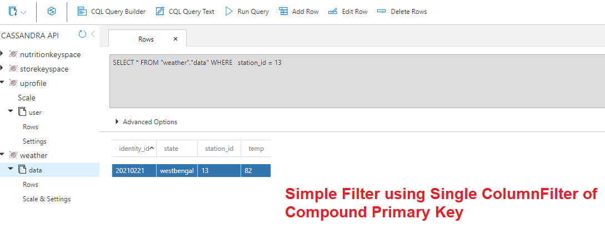
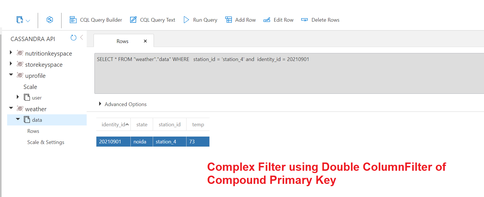

# CassandraAPICosmosDBHandsDirty

**Summary:**
This document provides guidance on getting your hands dirty using Azure Cosmos DB API for Cassandra Database.

## Introduction
Azure Cosmos DB Cassandra API can be used as the data store for apps written for [Apache Cassandra](https://cassandra.apache.org/_/index.html). This means that by using existing Apache drivers compliant with CQLv4, your existing Cassandra application can now communicate with the Azure Cosmos DB Cassandra API. In many cases, you can switch from using Apache Cassandra to using Azure Cosmos DB's Cassandra API, by just changing a connection string.

The Cassandra API enables you to interact with data stored in Azure Cosmos DB using the Cassandra Query Language (CQL) , Cassandra-based tools (like cqlsh) and Cassandra client drivers that you're already familiar with. For more information, visit the official Microsoft [documentation for Azure Cosmos DB API for Cassandra Database](https://docs.microsoft.com/en-us/azure/cosmos-db/cassandra/cassandra-introduction).

## About Azure Cosmos DB
Azure Cosmos DB is a fully managed NoSQL database for modern app development, with SLA-backed speed and availability, automatic and instant scalability, and open-source APIs for MongoDB, Cassandra, and other NoSQL engines. For a more in-depth coverage of Azure Cosmos DB, you should visit the official site here > https://docs.microsoft.com/en-us/azure/cosmos-db/introduction


## Getting Started
If you're looking to get started quickly, you can find a range of SDK Support and sample Tutorials using .NET, .NET Core, Java, Python etc. [here](https://docs.microsoft.com/en-us/azure/cosmos-db/cassandra/manage-data-dotnet).

## What you learn from this Sample?
Key learning include:
- Creating an Apache Cassandra Keyspace in Azure Cosmos DB using API for Cassandra leveraging C#.
- Providing provisioned throughput (RU) at keyspace level.
- Creating an Apache Cassandra Table in Azure Cosmos DB using API for Cassandra.
- Providing provisioned throughtput (RU) at table level.
- Best practices for creating a Primary Key in Cassandra (which includes 1 partitionKey + 0 or more Clustering Columns.
- Creating a table with a single Primary Key.
- Creating a table with a *Compound* Primary Key for a use-case wherein a single Primary Key will not work.
- Inserting data into both tables: uprofile.user and weather.data.
- Basic Query operations using a Basic query
- Query Operation trying to query table by filtering by non-primary key. Flags an error which is as per Cassandra Database.
- Solution to problem of querying table by filtering by non-primary key by creating a 'Secondary Index'.

## Running this Sample
This sample is in .NET. For running this sample, all you need to do is to download the Visual Studio Solution file; and then make the following changes as mentioned below. You can also leverage this GitHub repo for getting up and running quickly > https://github.com/Azure-Samples/azure-cosmos-db-cassandra-dotnet-core-getting-started.

## What you need for this Sample?
You need the following:
- An Azure subscription. If you do not have one, you can get a *free* one [here](https://azure.microsoft.com/en-in/free/) with USD 200 Credit.
- Working Azure Cosmos DB Account with Cassandra API. Learn how to create one using Azure portal [here](https://docs.microsoft.com/en-us/azure/cosmos-db/cassandra/manage-data-dotnet) using this Tutorial.
- Visual Studio Code / Visual Studio 2019 or similar IDE. You can download your VS [here](https://visualstudio.microsoft.com/downloads/).
- Working knowledge of both Apache Cassandra contructs, queries & limitations.
- Working knowledge of programming in .NET.
It is assumed that you possess all these for enjoying and doing further R&D on this sample. Simply clone this git repo (or download as Zip).

## A few things to do before deep-dive:
1. Open the Visual Studio Solution file; ensure your Nuget packages are upto date. Specifically, ensure that '[CassandraCSharpDriver](https://www.nuget.org/packages/CassandraCSharpDriver/)' is installed. Your packages.config file should resemble the same as shown below:



2.In the Program.cs file, edit the secion below. You will find these from your Azure portal, Cosmos DB account's Settings > Connection String:



```
// Cassandra Cluster configs section.
private const string UserName = "<< ENTER YOUR USERNAME >>"; 
private const string Password = "<< ENTER YOUR PRIMARY PASSWORD >>";
private const string CassandraContactPoint = "<< ENTER YOUR CONTACT POINT >>";  // DnsName
private static int CassandraPort = 10350;                                       // Leave this as it is
```

## Output in VS:

- Once run successfully, the program should run to create 2 Keyspaces and 2 Tables respectively in each Keyspace.
- Next, it will also load data into the corresponding tables with the Keys that have been created.
- Keyspace 'uprofile' has table user with a single PrimaryKey; keyspace 'weather' has table data with a Compound PrimaryKey.
- At this stage, you can pause to take a look at your resources in the Azure portal.



- And then proceed to testing Basic Query Operations including one which throws an Error. You can research as to why this operation is not allowed in Cassandra DB.


## Validate in Azure Portal:

In the Azure portal, you should find screens similar to these and do further R&D in Data Explorer.

- 2 Keyspaces and 2 Tables created. One with Shared Keyspace-level RU, and one with Provisioned Table-level RU.


- All data correctly loaded into Table 'uprofile.user'.


- Use the **CQL Query Builder** & **CQL Query Text** in Data Explorer, to query table uprofile.user with a simple filter (e.g. user_id = 7).


- All data correctly loaded into Table 'weather.data'.


- Use the **CQL Query Builder** & **CQL Query Text** in Data Explorer, to query table weather.data with a simple filter. Please note that this table has a **Compound** Primary Key (station_id, identity_id). First, we filter against 'station_id' = station_13. The result is as expected and the row is extracted from the database.


- Next, we use the **CQL Query Builder** & **CQL Query Text** in Data Explorer, to query table weather.data with a complex filter. Please note that this table has a **Compound** Primary Key (station_id, identity_id). We now filter against 'station_id' = station_4 & 'identity_id' = 20210901 which represents our 'Noida' Weather Station in our dataset. The result is as expected and the row is extracted from the database.



## Feedback
You can share any feedback at: sugh AT microsoft dot com

## License & Terms of Use
This is a free white paper released into the public domain. Anyone is free to use or distribute this white paper, for any purpose, commercial or non-commercial, and by any means. Same applies to the code in the repo.

THE WHITE PAPER IS PROVIDED "AS IS", WITHOUT WARRANTY OF ANY KIND, EXPRESS OR IMPLIED, INCLUDING BUT NOT LIMITED TO THE WARRANTIES OF MERCHANTABILITY, FITNESS FOR A PARTICULAR PURPOSE AND NONINFRINGEMENT.

IN NO EVENT SHALL THE AUTHORS BE LIABLE FOR ANY CLAIM, DAMAGES OR OTHER LIABILITY, WHETHER IN AN ACTION OF CONTRACT, TORT OR OTHERWISE, ARISING FROM, OUT OF OR IN CONNECTION WITH THE WHITE PAPER.

Have fun & happy coding!
